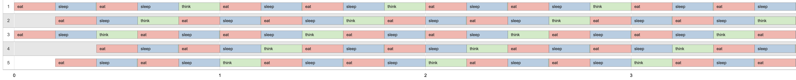

# Philosophers

Основной целью было понять, как работают потоки на языке C и использовать их для решения логической задачи обедающих философов - https://en.wikipedia.org/wiki/Dining_philosophers_problem.

Суть задачи в том чтобы созданные потоки использовали ресурсы системы не приводя к таким проблемам как: 
- Состояния взаимной блокировки. Когда все процессы застреват в вечном ожидании ресурса.
- Ресурсного голодания. Когда по какой либо причине процессу постоянно отказывают в необходимых ресурсах для обработки его вычислений.

### How to use it

```
git clone https://github.com/wyholger/Philosophers.git

cd Philosophers/philo

make

./philo 3 99 33 33 100            # should live

./philo 2 100 50 100              # should die

```

```
./philo <N> <TD> <TE> <TS> <E>
```

* <N> - Количество философов.
* <TD> - Время в миллисекундах, пока философ не умрет от голода.
* <TE> - Время в миллисекундах, необходимое философу для еды.
* <TS> - Время в миллисекундах, необходимое философу для сна.
* <E>(Необязательно) - Количество приемов пищи до остановки программы.

### Visualization

